# central-sports-web アーキテクチャ設計書

## 1. 設計方針

### 1.1 アーキテクチャパターン

単一プロセス内に UI サーバ、スケジューラ、セッション管理、永続ストアへのアクセスを同居させるレイヤード構成とする。他プロセスとの協調は行わず、状態はプロセス内メモリと単一の永続ストアに集約する。

層は次の 4 つに分ける。

- **プレゼンテーション層**: HTTP ルーティングと HTML テンプレート生成。ダッシュボードと予約画面（単発予約タブ・定期予約タブ）を担う。
- **アプリケーションサービス層**: ユースケース単位の処理を置く。予約の作成・取消・席変更、定期予約の登録と実行、配置プレビューの生成、当日サマリーの集計などがここに集まる。
- **外部連携層**: 予約 API、公開月間 API、Discord などの外部通信を担う。セッション管理が集中管理する。
- **永続化層**: 永続ストアへの読み書き。書き込みは単一のキューで直列化する。

上位層は下位層にのみ依存し、逆向きの依存を禁止する。外部連携層と永続化層はアプリケーションサービス層から呼ばれる並列関係。

### 1.2 技術スタック

Web アプリは Python 製。非同期 I/O の HTTP サーバを採用するが、外部 HTTP クライアントは TLS 指紋互換を保つために同期ライブラリを使う。同期処理はバックグラウンドスレッドに逃がして非同期ループを阻害しないようにする。

UI はサーバサイドレンダリング。JavaScript は対話的な挙動が必要な箇所（タブ切替、座席選択、配置プレビューの項目選択など）に限定し、SPA 化はしない。CSS はカスタムプロパティでデザイントークンを定義した自前スタイルシート。

永続ストアは組み込み型の軽量 RDB を採用する。単一プロセス・低同時接続で運用コストを抑えるため。

スケジューラはプロセス内常駐のものを採用し、予約実行ジョブと月次・週次の同期ジョブを同一プロセスで扱う。

外部依存ライブラリのバージョンはリポジトリ内のロックファイル（`requirements.txt` 等）が正。本書には記載しない。

---

## 2. システムコンテキスト

### 2.1 外部インターフェース

**図 2.1: システム構成図**

| 接続先 | プロトコル | 認証方式 | 使用ライブラリ方針 |
|---|---|---|---|
| 予約 API（reserve.central.co.jp） | HTTPS | Cookie（`device_id` + アクセストークン） | TLS 指紋互換の同期 HTTP クライアント（Chrome 相当） |
| 公開月間 API（www.central.co.jp） | HTTPS + JSONP | なし | 同上（JSONP のコールバックを剥がして JSON パース） |
| Discord Webhook | HTTPS | Webhook URL | 標準の同期 HTTP クライアントで十分 |
| 利用者ブラウザ | HTTPS | Basic 認証または Cookie | Web アプリフレームワーク標準 |
| シークレットストア（`/workspace/.secrets`） | ファイル読み取り | なし（読み取り専用マウント） | Fernet 復号（既存ユーティリティを再利用） |

予約 API への通信は市場データ基盤側の同等処理と同じ方針で、Chrome の TLS 指紋と HTTP/2 プロファイルを再現するクライアントを使う。これにより、受け手から見て通常のブラウザ操作と区別しにくい通信になる。

---

## 3. コード構造

### 3.1 コードマップ

`tools/central-sports-web/` 配下に次のディレクトリを置く。

- `app/` — Web アプリ本体。プレゼンテーション層・アプリケーションサービス層・永続化層のモジュールをさらに細分化する。
- `scheduler/` — プロセス内スケジューラのジョブ定義（月次同期、週次差分、日次準備、日次の予約実行）。
- `client/` — 外部 API クライアント層。事前調査で用意した `cs_api.py` と `cs_secrets.py` を共有する。
- `db/` — 永続化層。スキーマ定義、軽量マイグレーション、書き込みキュー。
- `ui/` — テンプレートと静的ファイル。ダッシュボード、単発予約タブ、定期予約タブの 3 つのビューとそれらに紐づくパーシャルを含む。CSS は 1 枚で共有。
- `config/` — 設定ファイル（接続先、店舗の既定値、通知設定など）。
- `docs/design/` — 本仕様書群と図。
- `docker-compose.yml` — コンテナ定義。

ファイル単位の詳細はソース側が正とし、本書には書かない。

### 3.2 依存関係

- プレゼンテーション層 → アプリケーションサービス層 → （外部連携層 / 永続化層）。
- スケジューラ → アプリケーションサービス層（UI と同じユースケースを共用）。
- 外部連携層 → 外部サービス（双方向）。
- 永続化層 → 永続ストア（双方向、書き込みは直列化キューを介す）。
- 禁止: 外部連携層と永続化層が互いに直接依存すること。アプリケーションサービス層を経由させる。

### 3.3 拡張方法

新しい機能を追加する場合は次の順で進める。

1. アプリケーションサービス層にユースケース関数を追加する。
2. 必要に応じて外部連携層に API ラッパを追加する（`cs_api.py` の拡張）。
3. 永続化層にテーブルや問い合わせを追加する。スキーマ変更時は軽量マイグレーションを書く。
4. プレゼンテーション層（HTTP ルート + テンプレート）、もしくはスケジューラにエントリポイントを追加する。
5. 実行履歴の記録点を追加する（構造化ログ + Discord 通知レベル）。

---

## 4. データ設計

### 4.1 ストレージ方式

組み込み RDB に WAL モードを有効化して使う。同期書き込みは性能要件を満たす範囲で NORMAL を選ぶ（クラッシュ耐性が必要なら FULL へ昇格）。

アトミック書き込みはトランザクション単位で保証する。アプリケーションサービス層のユースケース 1 回に対してトランザクション 1 件を原則とし、スケジューラと UI の同時書き込みは単一の書き込みキューで直列化する。

### 4.2 状態管理

**図 4.1: 定期予約の状態遷移**

主なエンティティは次の 5 つ。

- **定期予約**: 毎週の予約ルール。曜日・時刻・プログラム ID（表記揺れに対応するための主キー）・プログラム名（表示用スナップショット）・希望席の配列・有効フラグ・状態（有効 / 予定済み / 実行中 / 成功 / 失敗 / スキップ / 一時停止）。
- **予約**: 予約 API から返された結果のローカル記録。外部識別子、ローカル識別子、対象レッスン、席番号、状態、由来（単発 / 定期予約）と由来が定期予約の場合の元 ID。由来の紐付けにより「この予約は定期予約から」「この予約は単発」を区別し、画面に出す情報を変える。
- **実行履歴**: 外部 API 呼び出しの記録。リクエスト識別子、所要時間、エンドポイント、結果、マスク済みのメタ情報。値はマスキング後のみ保存する。
- **スケジュールキャッシュ**: 月間テンプレートと直近実スケジュールのスナップショット。クエリキー（店舗・ルーム・年月・取得時刻）単位で保持し、TTL で再取得する。
- **店舗マスター**: 店舗・ルームの識別子と表示名。UI プルダウンの選択肢。

保持期間は実行履歴が 90 日、予約結果が 365 日、スケジュールキャッシュが当月 + 前月（テンプレート）と直近 7 日（実スケジュール）を目安とする。

**配置プレビューと当日サマリーの導出:**

どちらも独立したエンティティではなく、既存のエンティティから導出する。

- **配置プレビュー**: 選択中の定期予約について、スケジュールキャッシュから今後 4 週分の該当レッスンを引き、定期予約のプログラム ID と突き合わせる。名前が変わっていれば「プログラム変更」、時間帯が違えば「時間変更」、通常担当と異なれば「代行」として差分フラグを付けて返す。永続化は不要で、要求時に計算する。
- **当日サマリー**: 実行履歴の当日分を集計し、成功・代替成功・失敗の件数と明細を生成する。翌朝の実行開始（9:00）時点でリセットされる（表示上はリセット、履歴自体は残る）。

**定期予約の例外（この回だけ変更）:**

定期予約で取れた予約に対して利用者がその回だけ席を変えた場合、変更後の席を予約エンティティ側に保存するだけでよく、定期予約のルールは変えない。翌週以降の自動予約は従来どおり定期予約の希望席で動く。「この回だけ変更した」という事実は予約の状態として見えれば十分で、専用の例外テーブルは作らない。

カラム定義やインデックスの詳細はスキーマ定義ファイルが正とし、本書には書かない。

### 4.3 バックアップ

週次ジョブで永続ストアの内容を JSON として書き出す。コンテナ再作成に備える。復旧は JSON からの再 import で行う。シークレットはエクスポート対象外（メモリにしか存在しない）。

---

## 5. インフラ・デプロイ

### 5.1 環境構成

**図 5.1: 配置図**

単一コンテナで全機能を稼働させる。ホストの Synology NAS に 2 種類のボリュームをマウントする。

- **ソース + 永続ストアボリューム**: アプリのソースコードと永続ストアを置く。読み書き可能。
- **シークレットボリューム**: マスター鍵と暗号化されたシークレットを置く。読み取り専用。

ポートは LAN 内のみ公開し、外部からの直接アクセスは許容しない。再起動方針は `restart: always` で NAS 再起動時にも自動で立ち上がる。

### 5.2 パス設計

ホストの物理パスとコンテナ内パスを明確に分ける。コンテナ内ではアプリのソースを `/workspace/toolbox/tools/central-sports-web/` に配置し、シークレットは `/workspace/.secrets/` にマウントする。既存のシークレット連携方針に合わせる。

### 5.3 環境分離

運用は本番のみ。開発時はローカルマシンで `dry-run` フラグを有効にして予約 POST を抑止し、Discord 通知で内容確認のみ行う。テスト環境として別コンテナを立てる運用は本フェーズでは採用しない（単一プロセスで複雑度が低いため）。

---

## 6. 横断的関心事

### 6.1 セキュリティ実装

- **シークレットの復号**: 事前調査用 CLI と同じ復号ユーティリティを使う。プロセス起動時に 1 回復号し、メモリ上で保持する。ファイルに書き戻さない。
- **マスキング境界**: 構造化ログ、Discord 通知、画面応答の出力境界で、メールアドレス・パスワード・アクセストークン・Cookie 値を `***` に置換する処理を 1 箇所にまとめる。
- **Web UI 認証**: Basic 認証または Cookie ベース認証を必須とする。未認証リクエストはルーティング層で即座に弾く。
- **コンテナの egress 制限**: 外向き通信先を予約 API・公開月間 API・Discord Webhook の 3 点のみに限定する方針（具体的な iptables 等の設定は運用マニュアル側）。
- **通信互換性**: 予約 API への通信は TLS 指紋互換の HTTP クライアントで行う。ヘッダセット（UA、sec-ch-ua、sec-fetch-*、Accept 系）を Chrome 相当で統一する。

### 6.2 エラーハンドリング

予約 API の応答を次のカテゴリに分類し、振る舞いを決める。

| カテゴリ | 例 | 振る舞い |
|---|---|---|
| 認証失効 | トークン無効 | 1 回だけ再ログインを試行して retry |
| 検証エラー | 入力不正 | 実装バグとして扱い通知、再試行しない |
| ビジネスエラー | 満席・既予約・時間外 | 次の希望席を試行。もしくは停止 |
| 一時的サーバエラー | 5xx | 短時間バックオフで少数回 retry、超過で通知 |
| ネットワークエラー | timeout・DNS | 上記 5xx と同等扱い |

予約実行の失敗で通知しない分類はない（何らかの応答は必ず行う）。

### 6.3 ログと履歴

内部の開発者向けには構造化ログ（JSON Lines）を出力する。各エントリにタイムスタンプ、ログレベル、リクエスト識別子、アプリケーションサービス関数名、所要時間、結果、マスク済みのメタ情報を含める。

UI 上の「予約履歴」と「発火ログ」は別物として扱う。前者は利用者向けに整形された表示、後者は内部のデバッグ用。文言の使い分けは UI 文言に「履歴」、内部ドキュメント・コードに「ログ」で統一する。

Discord Webhook 通知は Embed 形式で、レベルに応じた色分けと件名・詳細を付ける。通知失敗は予約失敗とは切り分け、実行ログにだけ記録する。

### 6.4 テスト戦略

- **単体テスト**: マスキング関数、定期予約のマッチングロジック、状態遷移、エラー分類の判定、配置プレビューの差分計算、当日サマリーの集計。外部通信を伴わない純粋な関数を重点的にカバーする。
- **統合テスト**: 予約 API への通信はモック（録画再生）で代替する。実サーバに対するテストはごく少数の smoke test のみ（本番アカウントへの副作用を避けるため `dry-run` 前提）。
- **スケジューラテスト**: 時刻固定のテストダブルで 9 時の予約実行フローを通す。
- **カバレッジ**: 重要なユースケース（予約実行、エラー分類、状態遷移、差分計算）を優先する。数値目標よりも回帰防止に注力する。

---

## 7. 技術的制約

### 7.1 環境制約

- Synology NAS 上の Docker で稼働。ホスト OS は Linux。
- NAS の時刻同期（NTP）はホスト側で実施済みの前提。アプリ側は NTP 連携を行わない。
- 永続ストアのファイルはホストのボリューム上に置くため、btrfs スナップショットとの相互作用に注意する。本件は永続ストアのみで影響は限定的。

### 7.2 パフォーマンス制約

- 予約 API の POST は実測で 200 ms 前後。9:00:00 JST に合わせたうえで、ミリ秒単位の送信精度を保つため、スケジューラの `misfire_grace_time` と Python の短時間 sleep による補正を組み合わせる。
- 9:00 直前に実スケジュール取得を行う関係で、準備ジョブ（8:55）と実行ジョブ（9:00）の間に外部通信が失敗する可能性がある。直前のスケジュール取得は 8:55 取得 → 9:00 直前に再確認の 2 段階で行う。
- 単一コンテナ・単一プロセスの前提で、スケジューラの同時ジョブ数は 1 に制限する。

---

## 8. 設計判断記録

### 採用: 常駐プロセス方式

**決定**: Docker コンテナを常駐させ、プロセス内にスケジューラとセッション管理を置く。

**理由**: 9 時ちょうどの応答性を確保するため。毎回コンテナを起動する方式では 14 秒のオーバーヘッドが乗り、数秒の競争に敗れる可能性が高い。

**トレードオフ**: コンテナが落ちると実行機会を逃すリスクがある。`restart: always` と週次バックアップで補完する。

### 採用: TLS 指紋互換の同期 HTTP クライアント

**決定**: 予約 API への通信に Chrome の TLS 指紋を再現する同期 HTTP クライアントを使う。

**理由**: 標準の非同期 HTTP クライアントはデフォルトの TLS 指紋が独特で、通常のブラウザ通信と区別されやすい。市場データ基盤側の既存 collector と同じ方針。

**トレードオフ**: 同期ライブラリのため非同期ループを阻害する。バックグラウンドスレッド機構で逃がすことで整合を取る。

### 採用: 組み込み RDB

**決定**: 永続ストアに組み込み型の軽量 RDB を使う。

**理由**: 単一プロセス・低同時接続で運用コストが最小。バックアップも単一ファイルの export/import で完結する。

**トレードオフ**: 将来マルチプロセス化する際は別 RDB への移行が必要。本フェーズではその可能性は低い。

### 採用: プログラム ID ベースの識別

**決定**: 定期予約のマッチングは予約 API の program_id を主キーとして行う。プログラム名は表示用のスナップショットとして保持する。

**理由**: 同じレッスンでも週や月によって名前の表記が揺れることがある（半角・全角、大文字小文字、接尾辞の違い等）。名前ベースで同一性を判定すると代行や表記揺れで別プログラム扱いになり、取り逃すリスクがある。

**トレードオフ**: プログラム ID が予約 API 側で変更された場合は追従が必要。利用者が UI 上で紐づけ直せる導線を用意する。

### 採用: ダッシュボード 1 本の横長サマリー

**決定**: 当日の結果表示は、ダッシュボード先頭の横長バー（当日サマリー）1 つに集約する。

**理由**: 「今月の予約数」「発火成功率」「平均発火遅延」といった数値カード群を置く案は、毎日見る画面としては情報過多。利用者が毎朝知りたいのは「今朝の予約が取れたか」の 1 点に集約できる。

**トレードオフ**: 統計的な指標は UI からは見えない。必要な場合は別画面（将来の分析画面）か、履歴の集計で確認する。

### 採用: 定期予約と単発予約の連動（Outlook 風）

**決定**: 定期予約で取れた予約は、単発予約のカレンダーでも通常の「予約済み」として表示する。予約エンティティに由来（単発 / 定期予約）と元 ID を持たせて画面に出す情報を切り替える。その回だけの席変更は予約エンティティ側に保存し、定期予約のルールは変えない。

**理由**: 利用者から見れば、取れた予約は予約ルートに関わらず 1 つのカレンダーにまとまる方が自然。二重予約も統一的に防げる。その回だけの変更を定期予約のルールに反映すると、毎週のルール設計がブレて認知負荷が上がる。Outlook の定期予定の挙動と同じ発想。

**トレードオフ**: 予約エンティティのスキーマが少し複雑になる。画面側でも由来を意識した分岐が必要。例外テーブルは作らないため、「この回だけ」の履歴を追う際は予約エンティティの状態を頼る。

### 採用: 予約画面のタブ切替

**決定**: 予約画面を「単発予約」と「定期予約」のタブで切り替える構成にする。

**理由**: 単発予約はカレンダー中心、定期予約はルール管理とプレビュー中心で、レイアウトの要求が大きく異なる。1 画面に両方を詰め込むと不恰好になる。独立画面にするとサイドナビが増えて導線が冗長になる。

**トレードオフ**: タブ切替の 1 手間が発生する。両方を同時に見たいケースはカバーできないが、運用上その必要性は低いと判断した。

### 不採用: Playwright によるブラウザ自動操作

**決定**: 採用しない。HTTP クライアントレベルで十分。

**理由**: 起動コストとメモリ消費が大きく、9 時の応答性に悪影響。TLS 指紋互換の HTTP クライアントで必要な互換性は得られる。

### 不採用: cron + シェルスクリプト

**決定**: 採用しない。

**理由**: 事前ログイン状態を保持できず、9 時直前に毎回ログインが必要になる。ログイン所要時間（実測 487 ms）が読めず、時刻精度を担保できない。

---

## 9. 改訂履歴

| 日付 | バージョン | 概要 |
|---|---|---|
| 2026-04-19 | 0.2 | プレゼンテーション層にダッシュボードと予約画面（タブ）の構成を明記、定期予約エンティティをプログラム ID ベースに変更、配置プレビューと当日サマリーの導出方式を追加、設計判断記録に 3 項目追加（プログラム ID 識別・横長サマリー・タブ切替）、図を手書き SVG に刷新。予約エンティティに由来フィールドを追加、定期予約と単発予約の連動（Outlook 風）を設計判断として追加、「この回だけ変更」の扱いを明記。 |
| 2026-04-19 | 0.1 | 初版作成。事前調査（Issue #1）と spec.md 0.1 に対応した技術設計。 |
