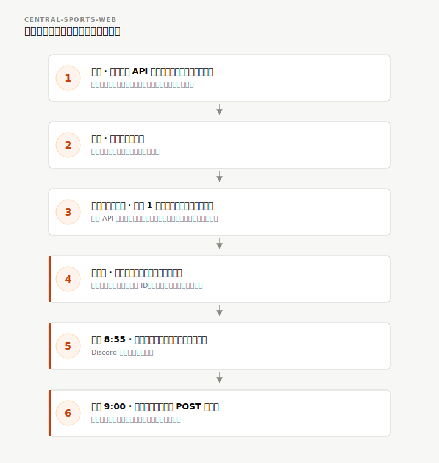
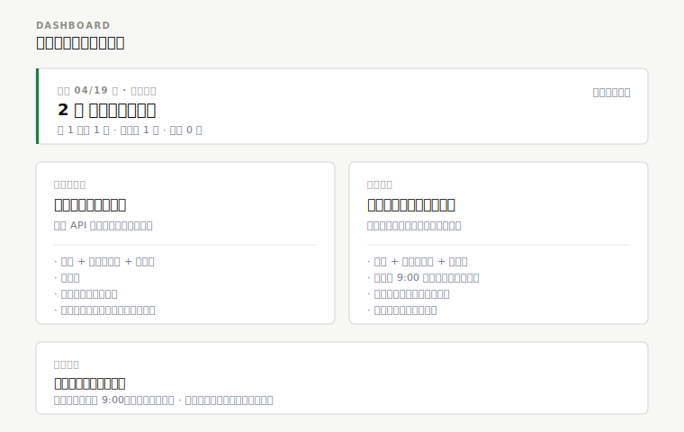
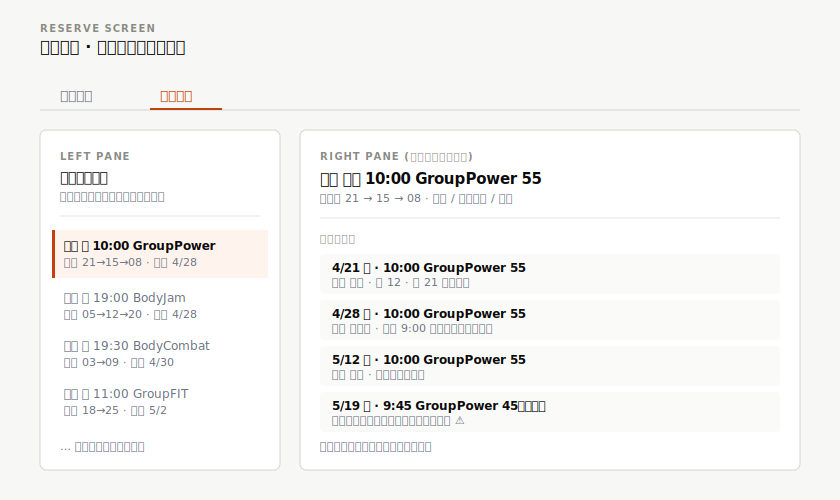

# central-sports-web 仕様書

## 1. 導入

### 1.1 目的

セントラルスポーツの会員サイトに対して、あらかじめ登録しておいた「毎週このレッスンを取りたい」という希望をもとに、予約開放の 9 時ちょうどに自動で予約を取りにいく常駐 Web アプリ。人気プログラムが数秒で埋まる中、朝 9 時に手で操作する余裕がない人が確実に席を確保できるようにする。

### 1.2 スコープ

**対象:**

- 毎週決まった曜日・時刻のレッスンを自動で予約する「定期予約」機能。
- 今日取れた結果と、明日以降に取りにいく予定を一覧できるダッシュボード。
- ブラウザから直接行う即時の予約・取消・席変更。
- 月間のレッスンテンプレートと直近 1 週間の実スケジュールを重ねたカレンダー表示。
- 複数店舗への対応（初期は府中 第 1 スタジオが既定）。

**対象外:**

- 施設入館の自動チェックイン。到着検知の難しさに見合った効果が薄いため、本フェーズでは扱わない。
- 複数アカウント対応。1 会員の自家利用を前提とする。
- 料金計算や決済。既存の会員契約がカバーする。

### 1.3 ステークホルダー

個人会員 1 名が自家利用する。平日は本業で日中に画面操作ができず、朝の予約開放に手動では参加できない。夜間や休日にまとめて登録し、当日朝の結果は通知とダッシュボードで確認したい。Web アプリの運用経験があり、ある程度の設定は自分で触れる想定。

### 1.4 設計方針

- **常駐プロセス化**: 9 時ちょうどの応答速度を確保するため、ログイン済みのセッションとスケジューラをプロセス内に保持する。毎回コンテナを起動する方式は立ち上げに 14 秒かかり、数秒の競争に敗れるため採用しない。
- **プログラム ID ベースの識別**: 同じレッスンでも週によって表記が揺れることがある。予約 API が返すプログラム ID を優先的な識別キーとして保存し、名前の揺れに振り回されない設計にする。
- **一般ユーザー向けの表現**: UI 文言から技術用語（「発火」「確保」「ログ」等）を避け、「予約しました」「履歴」「予約予定」といった日常語で揃える。設計・運用ドキュメントでは引き続き技術用語を使ってよい。
- **通信の互換性**: ブラウザと区別されにくい HTTP クライアントを使い、通常利用の範囲内で振る舞う。過剰な polling は行わず、9 時の予約実行時のみ正当な利用として POST を送る。
- **状態の外部化**: 定期予約の定義、予約結果、履歴、スケジュールのキャッシュは永続ストアに置き、プロセス再起動に耐えるようにする。認証トークンのみメモリ保持とし、失効時に自動で再ログインする。

---

## 2. システム概要

### 2.1 アーキテクチャ

**図 2.1: システムコンテキスト図**

Synology NAS 上の Docker コンテナとして常駐する。主な要素は次のとおり。

- **Web アプリ本体**: 利用者のブラウザからの操作を受け、永続ストアに定期予約や予約結果を読み書きする。外部サービスとのやり取りはセッション管理を通して行う。
- **セッション管理**: 認証トークンをメモリ上で持ち、失効を検知したら自動で再ログインする。外部の予約 API と直接通信する唯一のモジュール。
- **スケジューラ**: プロセス内に常駐し、毎朝 9 時前後の予約実行と、月次・週次のスケジュール同期を担当する。
- **永続ストア**: 定期予約の定義、予約結果、実行履歴、スケジュールキャッシュを保持する。

詳細なコンポーネント設計と技術選定は architecture.md を参照。

### 2.2 データフロー

**図 2.2: データフロー図**

1. 月初に公開月間 API から翌月分のプログラム定義を取得し、永続ストアにキャッシュする。
2. 週に 1 回差分を再取得し、代行や時間変更を反映する。
3. 画面アクセス時に直近 1 週間の実スケジュールを予約 API から取得し、キャッシュと重ねてカレンダーに表示する。
4. 利用者は画面で定期予約を登録する。希望席は複数候補を並べて指定できる。
5. 毎朝 8:55 頃に事前ログインと対象レッスンの解決を行い、Discord に準備完了を通知する。
6. 9:00 ちょうどに定期予約ごとに予約 POST を希望席の順に試みる。
7. 結果は永続ストアに記録し、Discord で利用者に通知する。利用者はダッシュボードで結果を確認する。

### 2.3 外部インターフェース

| 接続先 | 方式 | 用途 |
|---|---|---|
| 予約 API（reserve.central.co.jp） | HTTPS + Cookie 認証 | ログイン、スケジュール取得、予約の作成・取消・席変更 |
| 公開月間 API（www.central.co.jp） | HTTPS + JSONP | 月間のレッスンテンプレート（代行反映前） |
| Discord | Webhook | 予約結果と障害の通知 |
| 利用者ブラウザ | HTTPS + Basic 認証 | 画面操作 |

---

## 3. 機能要件

### 3.1 認証とセッション管理

会員のメールアドレスとパスワードで予約 API にログインし、受け取ったアクセストークンを Cookie としてメモリに保持する。失効を検知したら自動で再ログインするが、連続して失敗する場合はロックアウトを避けるために所定回数で止まり、通知を出す。

パスワードは外部のシークレットストアから復号して使うだけで、永続ストアにもログにも画面応答にも一切残さない。

### 3.2 画面構成

画面は 2 つ。ダッシュボードと予約画面で構成する。それぞれの役割を明確に分ける。

- **ダッシュボード**: 当日サマリー・現在の予約・予約予定・予約履歴を 1 画面に集約する。結果や状態の確認はすべてここに集める。
- **予約画面**: 予約の操作に絞る。タブで「単発予約」と「定期予約」を切り替える。単発予約タブはカレンダーから直接予約を作成・変更する。定期予約タブは毎週のルールを管理し、今後数週間の配置を確認する。予約結果や履歴はこの画面には出さない。

**定期予約と単発予約の連動:** 定期予約で取れた予約は、単発予約のカレンダーでも通常の「予約済み」として表示する。利用者から見ればその回の予約ルートを意識する必要はなく、取れたものは取れたもの、という一覧に集約される。同じ枠を二重に単発予約しようとしても、既予約として扱って拒否する。Outlook の定期予定の挙動に近い。

### 3.3 ダッシュボード

**図 3.1: ダッシュボード構成図**

- **当日サマリー**: 画面の先頭に横長のバーで、今朝の予約結果をまとめる。全件成功なら緑、代替席で取れたものがあれば黄色、取れなかったものがあれば朱色の縁取りで状態を示す。翌朝の実行前に自動でリセットする。
- **現在の予約**: 予約 API から取得した予約一覧。当日朝に取れたものもここに自動で入る。各行から席変更と取消が行える。
- **予約予定**: これから取りにいく予定のレッスンの一覧。各行には「明日 9:00 に予約」「4/23 9:00 に予約」など、いつ取りにいくかを表示する。予約が完了したものや失敗したものはここには載せない。
- **予約履歴**: 過去の自動予約の結果を時系列で並べる。当日分は「今朝 9:00」「昨朝 9:00」のように相対日付で先頭に置き、それ以前は日付で表示する。失敗したものは赤で示す。

### 3.4 単発予約（カレンダー）

カレンダーは曜日を横、時刻を縦に並べたタイムグリッドで描画する。月間テンプレートと直近 1 週間の実スケジュールを重ねて表示し、空きあり・予約済み・定期予約に登録済み・満席の 4 状態を色とラインで区別する。セルを選ぶと右側のパネルにレッスンの詳細と座席が出る。

右パネルから即時の予約作成・取消・席変更を行う。満席や予約期限切れの場合はエラー文言を表示する。

**定期予約由来の予約の扱い:** 予約の詳細パネルには、その予約がどの定期予約から取られたものかを表示する（該当する場合）。席だけこの回限りで別に変えたい場合は「この回だけ変更」、毎週のルール自体を見直したい場合は「定期予約を編集」の 2 つの導線を用意する。「この回だけ変更」は例外として記録し、翌週以降の自動予約には影響させない。

**仮スケジュール:** 月間テンプレートに載っていない日（祝日特別日、翌月分が未配信、等）でも、過去 1〜3 週前の実スケジュール（過去観測）が残っていれば、それを「仮スケジュール」として表示する。利用者は実データ開放前から予約予定を登録でき、開放日 09:00 に実データへ自動置き換わる。仮レッスンは薄いグレーと「仮」バッジで実データと区別する。3 週前まで観測がない時間帯は空欄のまま。

**休館表示は出さない:** 店舗定休（金曜など）でも UI には「休館」バッジを表示しない。利用者は曜日ヘッダから定休日を判別できる。データ上は確定休館日として保持し、仮スケジュール対象から除外する。

### 3.5 定期予約

**図 3.2: 定期予約タブ構成図**

毎週同じ曜日・時刻のレッスンを自動で予約するための仕組み。予約画面の定期予約タブで管理する。

- **登録**: 曜日・時刻・プログラムを指定して登録する。プログラムはカレンダー上のセルから選ぶか、プログラム ID で指定する。名前の表記揺れに左右されないように、可能な限り ID を主キーとして保存する。
- **希望席**: 第 1 候補から任意の数まで順位付きで指定する。実行時は第 1 候補から順に試み、取れたらそこで止まる。
- **配置プレビュー**: 選択中の定期予約について、今後 4 週間にどのレッスンが配置されるかを一覧する。担当者が通常と違う場合は「代行」、時間変更やプログラム短縮がある場合は目立つ色で差分を示す。実際にそのレッスンが取れるかは実行時まで分からないが、事前に気付けるようにする。
- **状態管理**: 有効・一時停止・削除が切り替えられる。一時停止中のものは配置プレビューに出ても予約実行の対象外になる。

この画面は予約の操作とルール管理に役割を絞る。過去の予約結果や履歴は表示せず、すべてダッシュボードで確認する。

### 3.6 毎朝の自動予約

**図 3.3: 定期予約の状態遷移図**

毎朝 8:55 頃に準備ジョブが動き、ログインと対象レッスンの解決を終えたうえで Discord に準備完了を通知する。9:00 ちょうどに直前の実スケジュールを取り直して対象レッスンを確定させ、希望席の第 1 候補から順に予約を試みる。取れたら停止し、全滅したら通知のみとする。

同じ定期予約の同日二重実行を防ぐため、冪等キー（定期予約の識別子と予定日の組み合わせ）で排他する。プロセス再起動で実行時刻をまたいだ場合は、所定の猶予時間内であれば 1 回だけ再実行を許容する。

定期予約の状態は、登録直後は有効、実行予定時刻に近づくと予定済み、実行中は実行中、結果に応じて成功・失敗・スキップとなる。翌週に向けて再び有効に戻る。手動で一時停止にすると実行対象から外れる。

### 3.7 手動の予約実行

検証やリカバリのために、利用者は定期予約を選んで任意のタイミングで予約を試せる。動きは 9 時の自動予約と同じだが、事前準備の通知は行わない。

### 3.8 通知

結果は Discord Webhook に送る。レベルは「成功要約」「失敗即時」「警告」の 3 段階。通知自体の送信失敗は、予約失敗と切り分けて履歴に記録するだけにし、予約処理は止めない。

---

## 4. 非機能要件

### 4.1 セキュリティ

- **UI アクセス制御**: Basic 認証または Cookie ベースの認証を必須とする。パスワードを預かるアプリに LAN 内からでも無認証で入れる状態は許容しない。
- **シークレットの分離**: 外部のシークレットストアを読み取り専用でマウントし、復号した結果はメモリ上でのみ保持する。永続ストア・画面応答・履歴には一切残さない。
- **通信互換性**: 予約 API への通信はブラウザと区別されにくいクライアントで行う。事前調査で用意した CLI と同じ方針。

### 4.2 信頼性

- **重複実行の防止**: 定期予約の識別子と予定日の組を冪等キーとし、同日に 2 回予約が走らないようにする。
- **エラーの分類**: 予約 API の応答コードを認証失効・既予約/満席・入力不正・サーバエラーに分類し、それぞれで再試行・停止・通知を使い分ける。
- **セッション失効の復旧**: 失効を検知したら 1 回だけ再ログインを試みる。連続失敗でロックアウトを誘発しないよう、所定回数で停止して通知する。
- **先回りしない**: 9:00 より早く予約 POST を送らない。遅延は許容する。
- **状態の復元**: プロセス再起動後、永続ストアから状態を復元して通常運用に戻れる。

### 4.3 パフォーマンス

- **予約 POST の応答性**: 事前調査の実測で予約 POST は 210 ms 前後、ログイン込みで 700 ms 前後。9:00 ちょうどからの遅延は ±1 秒以内を目標とする。
- **カレンダー表示**: 月間テンプレートはキャッシュから返す。画面の初期表示は外部 API 呼び出し 1 回以内で完結させる。
- **過剰な polling の抑制**: 空き監視のような定期的な問い合わせは原則行わない。行う場合でも分単位が下限。

### 4.4 制約条件

- 対象の予約 API は非公開の内部 API。仕様が変わった場合は実装の追従が必要。
- スケジュール開放は毎朝 9:00 JST 固定で、1 週間先までしか見えない（実測仕様）。
- 座席レイアウト（35 名・20 名・25 名の 3 種）によって指定できる席番号の範囲が異なる。実装着手前に追加調査で確定させる。
- ログイン失敗時のロックアウト機構の有無は未確認のため、リトライは慎重に設計する。

---

## 5. 運用

### 5.1 デプロイ

Synology NAS 上のコンテナとして常駐運用する。`restart: always` で NAS 再起動時にも自動で立ち上がる。タイムゾーンは `Asia/Tokyo` 固定。

シークレットは NAS 上の専用ボリュームを読み取り専用でマウントする。アプリはパスワードを復号して使うだけで書き換えない。永続ストアはアプリ専用のボリュームに置き、週に 1 回 JSON で書き出してバックアップする。

### 5.2 監視とアラート

- **外形監視**: 起動状態、直近のログイン状態、スケジューラ状態を返すエンドポイントを提供し、NAS 側の外形監視と連携する。
- **通知**: 予約の実行結果、障害、セッション失効を Discord Webhook で通知する。通知レベルに応じて Embed のスタイルを変える。
- **実行履歴**: 外部 API の呼び出しごとに所要時間とリクエスト識別子を構造化ログに残し、成功率と失敗コードの分布を確認できるようにする。

### 5.3 定期ジョブ

| ジョブ | 実行頻度 | 目的 |
|---|---|---|
| 月間スケジュールの全件取得 | 月初 | 翌月のテンプレートを永続ストアにキャッシュ |
| 月間スケジュールの差分取得 | 週次 | 代行や時間変更の反映 |
| 事前ログインと対象レッスン解決 | 平日/日次 08:55 | 9 時の予約実行の準備 |
| 定期予約の実行 | 平日/日次 09:00 | 登録済み定期予約の予約 POST |
| 永続ストアのバックアップ | 週次 | JSON での書き出し |

平日・祝日・休館日の扱いは利用者の事前登録に従う。休館日は登録側で除外する。

### 5.4 障害対応

| 事象 | 対応 |
|---|---|
| 予約 API のログイン失敗（認証情報変更など） | 所定回数で停止し、Discord に通知。以降のジョブは警告で保留 |
| 予約 POST で満席・既予約 | 次の希望席を試行。全滅なら通知のみ |
| 予約 API のサーバエラー（5xx） | 短時間バックオフで 1〜2 回再試行。超過で通知 |
| スケジューラプロセスの停止 | `restart: always` で再起動。猶予時間内なら再実行 |
| Discord Webhook の失敗 | 履歴に記録のみ。予約処理は継続 |
| 永続ストアの破損 | 週次バックアップから復旧。手順は運用マニュアル参照 |

自動復旧できない場合は Discord 通知で利用者の手動対応を促す。

---

## 6. 検討した代替案

- **毎回コンテナを起動する方式**: 既存 CLI の延長で `docker compose run --rm` する方式。実測で 14 秒かかり、9 時の競争に敗れる可能性が高い。
- **ブラウザ自動操作（Playwright 等）**: API 呼び出しと同じ効果が得られるが起動コストが重く、メモリ消費も大きい。HTTP クライアントに TLS 指紋互換を持たせる方式で十分と判断した。
- **cron + シェルスクリプト**: 事前ログインを保持できず、毎回ログインが必要になる。ログイン時間が読めず時刻精度を担保できない。
- **外部 SaaS スケジューラ**: セッションの持ち込みが難しく、コストも増える。NAS 上の常駐プロセスで完結させる方が軽い。
- **プログラム名による識別**: 初期案。月によって表記が揺れることがあり、同一性判定を誤る可能性があるため、可能な限りプログラム ID を主キーとする方式に変更した。
- **ダッシュボードのサマリーカード群**: 「今月の予約数」「発火成功率」等の数値カードを置く案を検討した。毎日見るダッシュボードとしては情報過多で、当日の結果だけを 1 本の横長バーで示す構成に変更した。

---

## 7. 改訂履歴

| 日付 | バージョン | 概要 |
|---|---|---|
| 2026-04-25 | 0.3 | 単発予約カレンダーに仮スケジュール表示を追加。月間データに無い日（祝日特別日 / 翌月未配信）を過去 1〜3 週前の観測値で埋めて「仮」バッジ付きで表示し、開放前でも予約予定を登録可能にする。「休館」バッジを廃止。 |
| 2026-04-19 | 0.2 | UI 方針の刷新。ダッシュボードに当日サマリー追加、予約画面をタブ化、「自動予約ターゲット」を「定期予約」に改称し予約画面へ移動、定期予約タブに配置プレビューを追加、プログラム ID ベースの識別、一般ユーザー向けの文言整理、図を手書き SVG に刷新。定期予約と単発予約の連動（Outlook 風）、この回だけ変更、予約画面の役割を予約操作に限定。 |
| 2026-04-19 | 0.1 | 初版作成。事前調査の結果と設計方針を統合。Issue #1 に対応。 |
