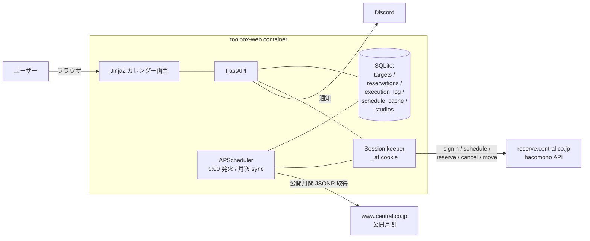

## 背景

セントラルフィットネスクラブ府中（第1スタジオ）の予約は**毎朝 9 時ちょうどに 1 週間先のスケジュールが開放**され、人気のプログラムは秒単位で埋まる。満席例: 2026-04-21 火 10:15 バレエエクササイズ 35/35、2026-04-22 水 11:55 ボディコアバランス 25/25、2026-04-23 木 11:05 シェイプパンプ 20/20。

マイページからの手動予約では間に合わないケースがあり、事前にターゲットを登録しておき 9 時ちょうどに自動で予約を取る仕組みを、常駐 Web アプリとして用意したい。

## 現状の問題

事前調査用の CLI プロトタイプは存在するが、実運用には次の制約がある:

1. **コンテナ起動オーバーヘッドが 14 秒**: 毎回新規コンテナを立ち上げるため、Python 自体は 1.8 秒で完了するのに全体で 16 秒かかる。9 時レースには間に合わない。
2. **UI なし**: 予約ターゲットを宣言的に登録する手段がない。
3. **自動発火なし**: スケジューラを持たない。

## スコープ / Non-Goals

**スコープ:**
- 対象スタジオ: 府中（studio_id=79, room=177）をデフォルト、他店舗もプルダウン切替可
- 対象機能: 予約作成・キャンセル・席変更・予約一覧・スケジュール閲覧・自動予約ターゲット管理・9:00 発火

**Non-Goals:**
- 施設入館の自動チェックイン（到着検知の複雑さに対し効果が限定的なため本フェーズ外）
- 多アカウント対応（Phase 4 以降、最小拡張余地だけ確保）
- レッスンの料金計算・決済（既存会員契約ベースで既に成立するため）

## 事前調査結果（完了）

### サイト構造
- `reserve.central.co.jp` は Nuxt SPA + Rails API（[hacomono](https://www.hacomono.jp/) フィットネス施設管理 SaaS）
- 公開月間スケジュール `https://www.central.co.jp/club/jsonp_schedule.php?club_code=XXX&yyyymm=YYYYMM`（JSONP）

### 主要 API（`https://reserve.central.co.jp/api` 配下）

| メソッド | パス | 役割 | CLI 実装 |
|---|---|---|---|
| POST | `/system/auth/signin` | ログイン（`{mail_address, password}` + Cookie `device_id`） | ✅ |
| POST | `/system/auth/signout` | ログアウト | ✅ |
| GET  | `/system/auth/detail` | 会員情報 | — |
| GET  | `/master/studio-lessons/schedule?query=<JSON>` | 1 週間分のスケジュール | ✅ |
| GET  | `/reservation/reservations/{lesson_id}/no` | 予約済み座席番号のリスト | ✅ |
| POST | `/reservation/reservations/reserve` | 予約作成 | ✅ |
| PUT  | `/reservation/reservations/cancel` | キャンセル（複数可） | ✅ |
| PUT  | `/reservation/reservations/move` | 席変更 | ✅ |
| GET  | `/reservation/reservations` | 自分の予約一覧 | ✅ |
| GET  | `/master/studios/grouping-by-category` | 店舗一覧 | — |

### 認証・セッション
- 必須ヘッダ: `X-Requested-With: XMLHttpRequest`、`Content-Type: application/json`
- Cookie: `device_id`（40 文字 hex、初回訪問時にクライアントが生成）
- signin 成功で Set-Cookie `_at` → 以降の API で認証に使う
- リクエスト body のキーは **snake_case**（例 `mail_address`）

### スケジュール仕様
- `schedule_open_days: 7`、`schedule_open_time: "09:00:00"` — 毎朝 9:00 に 1 週間先の枠が開放
- レスポンスの `studio_lessons.items[]` にレッスン、`studio_lessons.studio_room_spaces[]` に座席レイアウト（`space_num` = 定員）
- 空き席 = 定員 − 予約済み番号の件数（`/reservations/{id}/no` の戻り値）

### 公開月間スケジュール
- `yyyymm` 単位で週間テンプレートを取得できる
- 休館日・全プログラム定義を含む（予約不要のキッズスクール等も混在、`yoyakb` で判別）
- reserve API は「その週の実態」で代行を反映するのに対し、公開月間は「通常割り」を返す

### 店舗識別

| 用途 | キー | 値（府中） |
|---|---|---|
| reserve API | `studio_id` / `studio_room_id` | 79 / 177 |
| 公開月間 | `club_code` / `sisetcd` | 054 / A1（= 第1スタジオ） |

### 第1スタジオの座席レイアウト
- 35名レッスン / 20名（パンプ等）/ 25名（整列用）の 3 種が定義されている
- レッスンごとに参照するレイアウトが `studio_room_space_id` で切り替わる
- 20/25 名レイアウト時に座席番号の範囲（1-20 なのか 1-35 のうち先頭 20 か）は未検証 → **実装着手前に確認**

### 代行
- reserve API は実態（代行済）を返す。公開月間は通常担当
- 例: 2026-04-18 土 のパワーヨガは松田、2026-04-25 土 は長谷川 → 松田は代行
- **ターゲットキーにインストラクターを使わない**。`曜日 + 時刻 + プログラム名` が安定

### 計測結果

| フェーズ | 実測 |
|---|---|
| Python import | 1,071 ms |
| secrets 復号 | 10 ms |
| signin POST | 487 ms |
| **reserve POST** | **210 ms** |
| Python 合計 | 1,778 ms |
| コンテナ起動含む全体 | 16,088 ms |

常駐プロセス化によりコンテナ起動オーバーヘッドを排除できる。9 時レースには常駐化が必須。

## 新しい設計方針

### 構成
常駐 Web アプリ（サービス名: `toolbox-web`）を toolbox リポに追加する:

- バックエンド: FastAPI（Python）
- フロントエンド: Jinja2 テンプレート + 軽量 JavaScript
- 永続化: SQLite（ターゲット定義・実行ログ・月間スケジュールキャッシュ）
- スケジューラ: APScheduler（プロセス内常駐、9:00 発火 + 月次/週次同期）
- 認証セッション: プロセス常駐中はアクセストークンをメモリ保持、失効検知で再ログイン
- 実行環境: toolbox リポ配下に compose 定義を追加、`restart: always`。secrets は `/volume1/infra/secrets:/workspace/.secrets:ro` で ro マウント

配置先は toolbox の規約に合わせ、**`tools/central-sports-web/`**（既存 tool と兄弟配置）とし、docker compose 定義もこの配下に置く。

### 月次バックエンド同期
- 公開月間の JSONP を月次で自動取得 → DB にキャッシュ（月初更新 + 週次でも差分同期）
- reserve API のスケジュールは画面アクセス時 + 9 時発火直前に取得
- カレンダー UI は「月間テンプレート（通常割り）+ 直近 1 週間の実態」を重ね表示

### 画面構成案

カレンダーベースの UI。月間テンプレートと直近 1 週間の実態を重ね、各セルを選択すると詳細パネルが開く。

```
┌─ Central Sports Reserver ─────────────────────────────────────┐
│ 店舗: [府中 第1スタジオ (79/177) ▼]  ◀ 2026-04 ▶              │
├────────────────────────────────────────────────────────────┤
│ カレンダー（月間テンプレート + 直近 1 週間の実態）              │
│        日    月    火    水    木    金    土                 │
│ 09:00  .    .    .    .   [★] .    [・]                      │
│ 10:00  [・] .    .    .    .    .    [・]                     │
│ 11:00  [FULL][・] .    .    .    .    [・]                   │
│ 20:00  .    [・] [・] [・] [・] .    .                        │
│ [・]=プログラム有  [★]=自動予約登録済  [FULL]=満席             │
├────────────────────────────────────────────────────────────┤
│ [セル詳細]                                                    │
│   2026-04-23 木 09:15-09:55  フィールヨガ  片石                │
│   残り: 23/35                                                  │
│   [x] 毎週この曜日・時刻のこのプログラムを自動予約する           │
│   希望席: [1] (第2候補: [2]) (第3候補: [3])                   │
│   [今すぐ予約] [席変更] [手動キャンセル]                        │
│   キャンセル可能期限: 開始 N 分前まで（API 仕様要確認）         │
├────────────────────────────────────────────────────────────┤
│ [自動予約ターゲット一覧]                                       │
│   木 09:15 フィールヨガ  希望席 1→2→3  [状態: 待機] [無効化]   │
├────────────────────────────────────────────────────────────┤
│ [予約済み一覧]                                                │
│   2026-04-23 木 09:15 フィールヨガ no=2 [取消] [席変更]        │
└────────────────────────────────────────────────────────────┘
```

Mermaid 等の図は `tools/central-sports-web/docs/diagrams/` に `.mmd`+`.svg` で配置し、本文では `` で埋め込む（doc-conventions 準拠）。

### データモデル概要

SQLite に次のテーブル群を置く（詳細カラム定義は spec.md で確定）:

- **targets**: 自動予約の定義（曜日・時刻・プログラム名パターン・希望席の配列・有効フラグ・状態）
- **reservations**: 予約結果の記録（外部 id・ローカル ID・実行ターゲット ID・対象レッスン ID・座席・ステータス）
- **execution_log**: 全 API 呼び出しと予約試行のログ（request_id・所要時間・結果・エラーコード）。**secret は保存しない**、マスキング境界をコードで担保
- **schedule_cache**: 月間テンプレート（公開 JSONP 由来）と直近実スケジュールの snapshot（クエリキー単位で TTL）
- **studios**: 店舗・ルームのマスター（ユーザー選択の補助）

Phase 1 から `schedule_cache` は含める（MVP でもカレンダー表示に必要なため）。

### バックエンド API エンドポイント仕様（概要）

FastAPI で提供する REST エンドポイントの方針:

- `GET /` / `GET /calendar` — 画面 HTML
- `GET /api/studios` / `GET /api/rooms` — 店舗・ルーム選択肢
- `GET /api/calendar?studio_id&room_id&year_month` — カレンダー用データ（月間 + 直近 1 週間重ね）
- `GET /api/lessons/{lesson_id}` — セル詳細（空き数、座席マップ、自分の予約状態）
- `POST /api/reservations` — 即時予約（`{lesson_id, no}`）
- `PUT /api/reservations/{id}/seat` — 席変更
- `DELETE /api/reservations/{id}` — キャンセル
- `GET /api/targets` / `POST /api/targets` / `PUT /api/targets/{id}` / `DELETE /api/targets/{id}` — 自動予約ターゲット CRUD
- `POST /api/targets/{id}/run-now` — 手動即時発火（テスト/リカバリ用）
- `GET /healthz` — 生存確認（軽量、DB 接続は必須化しない）
- `GET /readyz` — 準備確認（scheduler 起動・直近 signin 状態・DB 接続を確認）

詳細な要求/応答スキーマは spec.md で定義する。

### 通信仕様（利用規約に準ずる / 通信互換性維持）
- 市場-platform の既存 collector と同じ方針で、**ブラウザと区別されにくい HTTP クライアント**を使う（curl_cffi で Chrome 131 の TLS 指紋互換）
- 通常の利用と区別されない範囲のヘッダセット（UA / sec-ch-ua / sec-fetch-* / Accept-*）を送る
- **高頻度 polling はしない**: 空き監視も分単位、9 時発火時のみ正当な予約行動として POST
- 失敗時のリトライは lockout を誘発しうるため **回数制限・バックオフ**（具体値は spec で）

### 9 時発火の時刻精度
- コンテナ TZ を `Asia/Tokyo` に固定、APScheduler も同 TZ で動かす
- 端末時刻ずれを抑えるため NTP 同期前提（host 側で担保）
- スケジューラのミスファイア方針は `misfire_grace_time` + `coalesce=True` + `max_instances=1` を既定（具体値は spec）
- 9:00 直前に Python 側で `time.sleep` による ms 単位補正（APScheduler の発火ジッターを吸収）
- 先回り発火は禁止（拒否されるリスク）、遅延は許容

### 重複実行防止
- 同一ターゲットの同日二重発火を防ぐため、**冪等キー**: `(target_id, scheduled_date)` のユニーク制約
- プロセスの二重起動対策として、DB 上の single-instance lock もしくは scheduler のジョブ ID を使った排他

### 席候補 retry
- 希望席を第 1 〜 N 候補で順次 try
- 1 候補あたりの timeout と try 間のバックオフを保有（具体値は spec）
- 全候補失敗時は「空き待ち」キューへ回すか即時通知するかを ターゲット設定で選択

### マッチングルール
- `曜日 + 時刻 + プログラム名パターン（部分一致/正規表現）` が基本
- 時刻は ±許容幅（数分）をオプション
- 同一曜日×時刻にマッチする枠が複数ある場合、プログラム名の最長一致を優先
- 祝日・月末跨ぎ・ルーム変更は ターゲット側の有効期間（開始/終了日）で制御
- 該当週に一致なしの場合はエラー扱いで通知

### エラーコード分類
hacomono の `errors[].code`（`AUT_000002`、`CMN_000001` 等）を次のように扱う（網羅は spec で拡張）:

- **認証失効**: 即 re-signin して 1 回だけ retry
- **満席 / 既予約**: ターゲットを「完了」にして通知、retry しない
- **検証エラー**（入力不正）: 実装バグ扱いで通知、retry しない
- **サーバエラー（5xx）**: 短時間バックオフで指定回数 retry、超過で通知

### ログ・通知
- 構造化ログ（JSON Lines）で `request_id`・所要時間・対象・結果を出力
- Discord 通知は Embed 形式で レベル別（成功要約/失敗即時/警告）
- Discord 通知失敗は予約失敗とは切り分ける（通知失敗は `execution_log` のみ）

### 運用・観測性
- `/readyz` で scheduler・DB・直近 signin の状態を確認
- 外部監視は既存 Netdata と統合できる形式で出力
- SQLite バックアップは週次でボリューム内に export（コンテナ再作成耐性）
- secrets ローテ（パスワード変更等）で signin 失敗したら即通知、以降のジョブは warning で保留

### Web UI 認証
- hacomono のパスワードを握るアプリであり LAN 内でも露出は危険
- Phase 1 時点で **Basic 認証 or Cookie ベース認証 を必須**
- master.key / `_at` cookie の値はレスポンスに返さない、DB にも保存しない

### 設計原則
- **カプセル化優先**（層の分離）
- **機能ブロック単位の組み立て**（つなぎ合わせで新機能を書けるように）
- **CLI と同じコードパス**: 既存 API クライアント（`cs_api.py`）と復号ユーティリティ（`cs_secrets.py`）を Web 側からも import して共有
- **状態は DB に寄せる**
- **失敗耐性**: セッション失効・timeout・5xx は個別ハンドリング
- **観測性**: 全外部 API 呼び出しの request_id と所要時間を execution_log に残す

### 非同期 I/O と同時書込み
- HTTP クライアントは同期ライブラリのため、FastAPI の非同期ループで重い呼び出しをブロックしないよう、`fastapi.concurrency.run_in_threadpool` かバックグラウンドタスクで逃がす
- SQLite は WAL モードを有効化、書込み側は scheduler と Web を経由して単一の書込みキューに集約

### 状態遷移（ターゲット）
- `active` → `scheduled`（9:00 発火待機）→ `running`（POST 中）→ `succeeded` / `failed` / `skipped` / `cancelled`
- 停止中は `disabled`。手動操作で任意の状態から遷移可能
- 状態遷移図は `tools/central-sports-web/docs/diagrams/target-states.mmd`（実装時に作成）

### 受け入れ条件（Phase 別）

**Phase 1（MVP: UI なし、常駐発火）:**
- 常駐プロセスが `restart: always` で永続稼働する
- 09:00 JST ±1 秒以内に対象ターゲットの予約 POST が投げられる
- 成功/失敗が Discord に通知される
- `execution_log` に全実行の記録が残る
- 応答や DB にパスワード・`_at` cookie が含まれない
- 同一ターゲットの同日二重発火が起きない
- プロセス再起動時に状態を復元できる

**Phase 2（UI 基本）:**
- 月間カレンダー UI が表示される
- 店舗/ルーム切替がプルダウンで動作する
- 即時予約・キャンセル・席変更が UI から実行できる
- Basic 認証などで UI への不正アクセスを防いでいる

**Phase 3（ターゲット管理）:**
- ターゲットの登録・編集・削除が UI でできる
- 希望席の第 1〜第 3 候補を指定できる
- ターゲット一覧が状態（active / disabled / recent result）付きで見える

### dry-run モード
- 開発・検証用に `POST /reserve` を抑止するフラグ。予約予定の内容だけ Discord/ログに通知する
- 本番デプロイではデフォルト OFF

### Warm-up（08:55 頃）
- 事前 signin + ターゲット対象の解決 + 候補席の空き確認を済ませて Discord に「準備完了」を通知
- 9 時発火時は確定済みの lesson_id に対して即 POST

## 影響範囲

### 新規
- `tools/central-sports-web/` — Web アプリ本体（FastAPI + Jinja2 + SQLite）
- `tools/central-sports-web/docker-compose.yml` — 常駐サービス定義
- `tools/central-sports-web/docs/diagrams/` — 構成図・状態遷移図（Mermaid ソースと SVG）
- `infra/services/gateway/projects/toolbox.yaml` — `cs-web-up` / `cs-web-logs` などの runner を追加

### 既存の再利用
- `tools/central-sports/cs_api.py` — HTTP クライアント（Web 側から共有 import）
- `tools/central-sports/cs_secrets.py` — 復号ユーティリティ（Web 側から共有 import）
- 既存 CLI は残置（デバッグ・保守用）

## 実装フェーズ

### Phase 1（MVP: 常駐発火のみ）
- `tools/central-sports-web/` に常駐サービス追加
- SQLite スキーマと最小ターゲット登録経路（YAML ファイル or 管理コマンド）
- APScheduler で 9 時発火
- Discord 通知

### Phase 2（UI 基本）
- カレンダー表示（月間 + 直近実態の重ね）
- 店舗/ルーム切替
- 即時予約・キャンセル・席変更
- Basic 認証

### Phase 3（ターゲット管理）
- ターゲット登録・編集・削除 UI
- 希望席複数化と retry
- 予約済み一覧（状態・残時間表示）

## 未決事項（実装着手前に検証で確定したい）

1. **`move` 後の reservation_id 挙動**: 席変更で内部 ID が切り替わる可能性。事前実験で確定
2. **キャンセル可能期限**: hacomono の仕様（開始 N 分前まで等）。実験 or API レスポンスから判定
3. **同時刻 multi-target 並列 POST の可否**: 同一アカウントで連続 POST を出せるか、拒否されるか
4. **20/25 名レイアウト時の `no` 範囲**: 1-20 なのか 1-35 のうち先頭か
5. **ログイン lockout の有無**: パスワード誤入力時の閾値。実装では 1 回失敗即停止が安全

これらは Phase 1 着手前に実験で確定し、本文へ結論を反映する。

## 関連

- [公開月間スケジュール（府中）](https://www.central.co.jp/club/schedule_detail.html?club_code=054&yyyymm=202604)
- [マイページ予約画面（府中 第1スタジオ）](https://reserve.central.co.jp/reserve/schedule/79/177/)
- [hacomono](https://www.hacomono.jp/)

## 概要図

実装時に `tools/central-sports-web/docs/diagrams/` 配下に `.mmd` ソースと `.svg` を配置する（doc-conventions 準拠）。以下はソースのドラフト:


